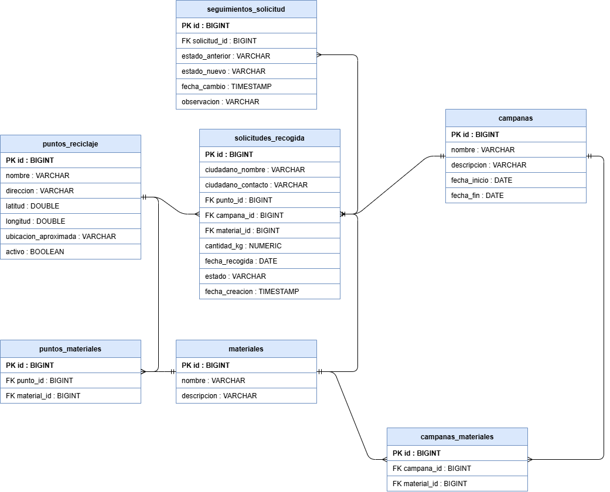

# reciclajeResiduos-api

API para la gestión de puntos de reciclaje y recogidas programadas.

Proyecto semestral de Programación Back-End. La comunidad consulta puntos de reciclaje y materiales aceptados, y solicita recogidas durante campañas. El backend aplica reglas del dominio (materiales compatibles, cantidades positivas, fechas habilitadas y estados de la solicitud).

La descripción completa del proyecto está en [documentos/descripcion-proyecto.pdf](documentos/descripcion-proyecto.pdf).

## Tecnologías

Java, Spring Boot, Maven, PostgreSQL, JPA e Hibernate, Git y GitHub.

## Modelo entidad-relación



El archivo editable (draw.io) está en [documentos/modelo-entidad-relacion.drawio](documentos/modelo-entidad-relacion.drawio).

## Ejecución

1. Crear la base de datos en PostgreSQL:

   ```sql
   CREATE DATABASE reciclaje_db;
   ```

2. Definir la contraseña de PostgreSQL como variable de entorno y arrancar la aplicación:

   ```powershell
   $env:DB_PASSWORD = "su_clave"
   .\mvnw.cmd spring-boot:run
   ```

3. Probar: `GET http://localhost:8080/api/estado`
